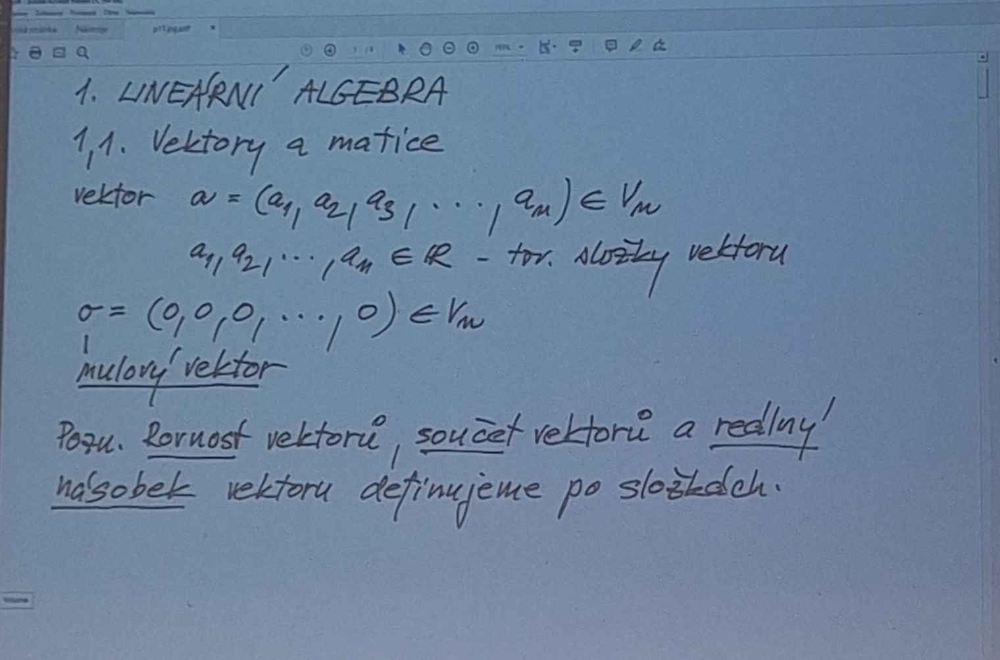
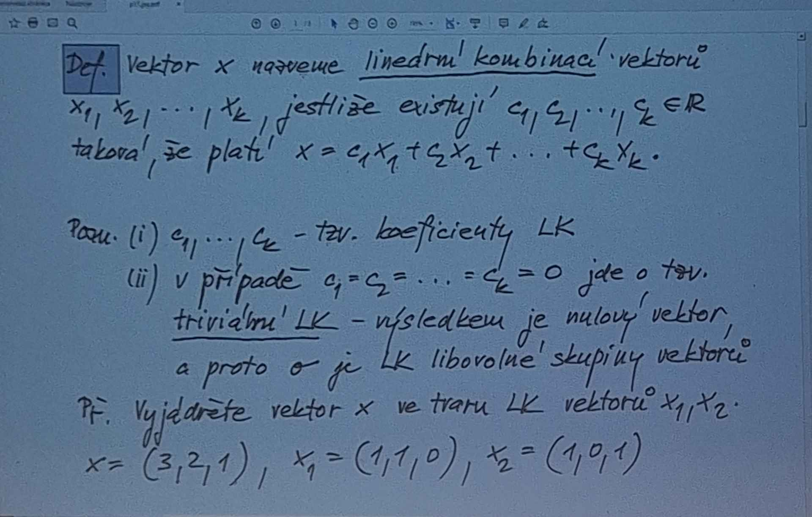
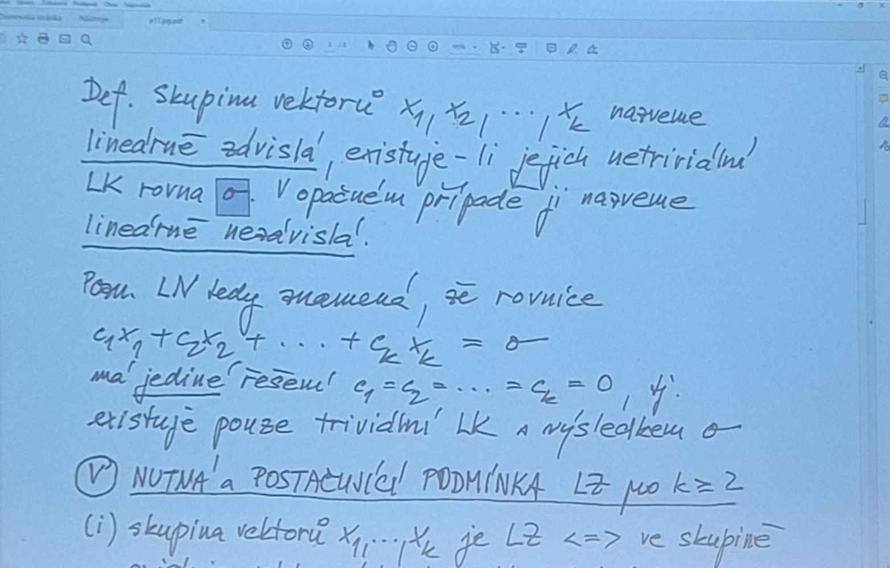
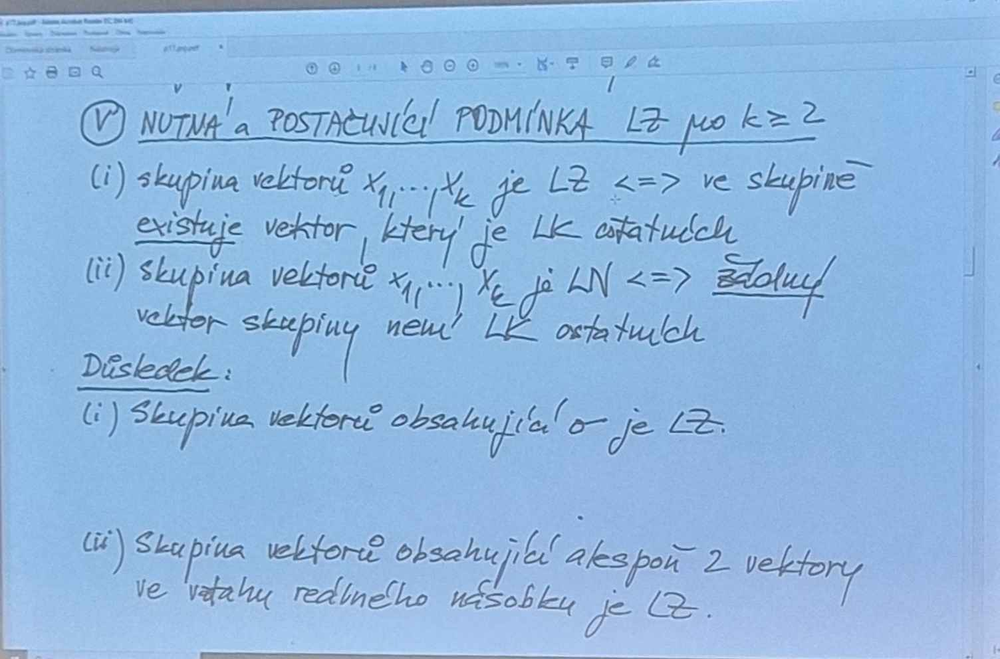
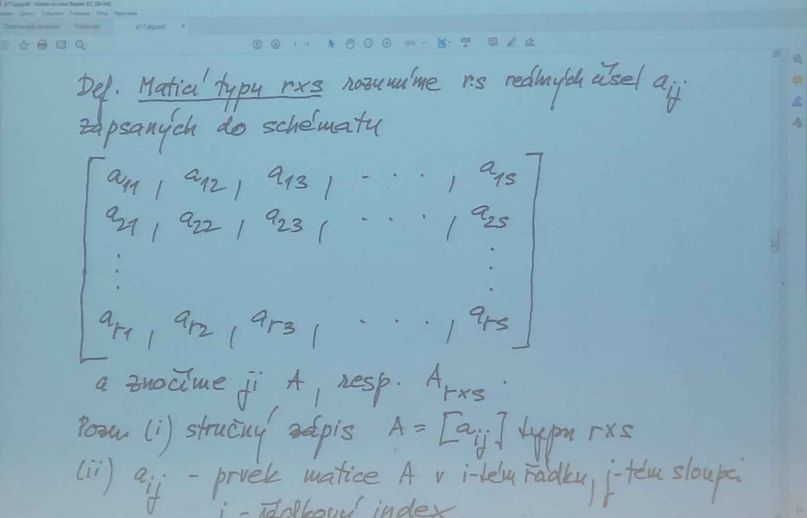
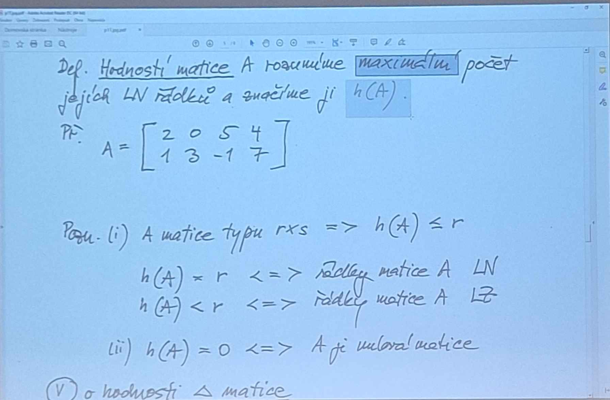
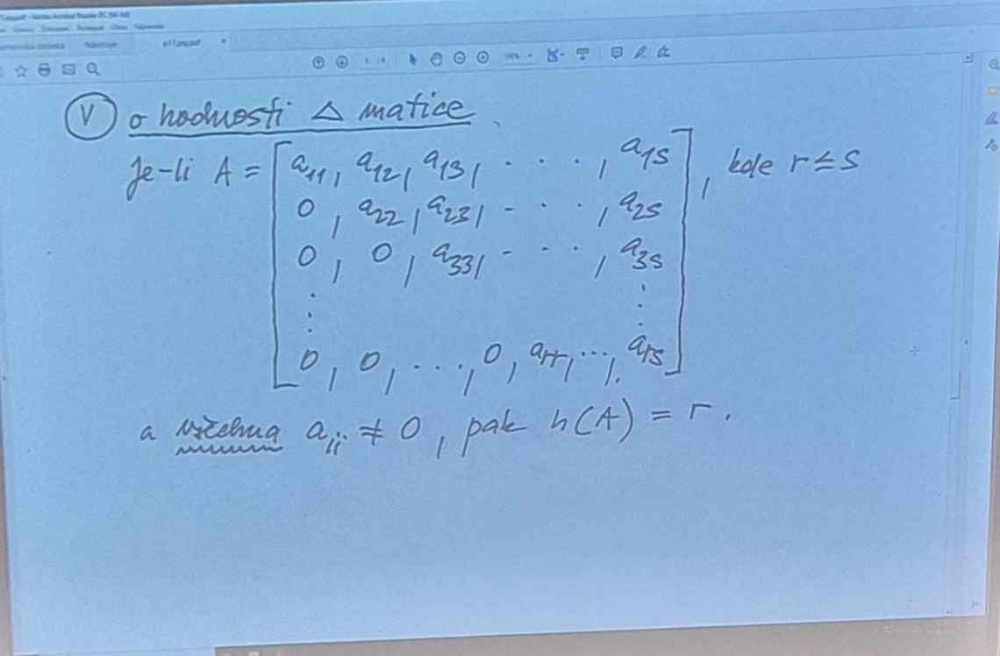
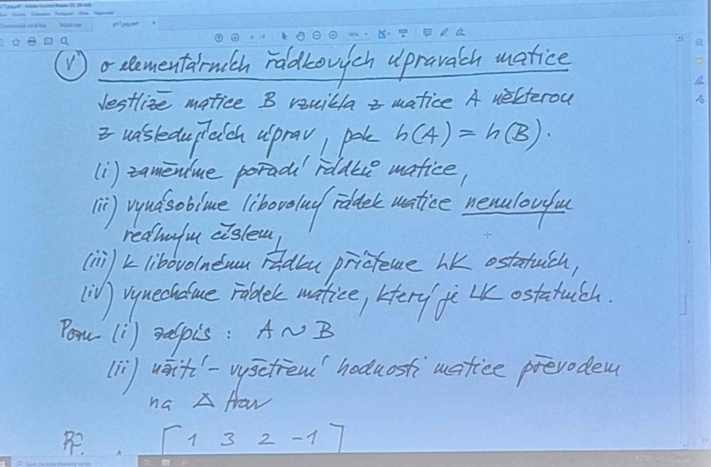

Vektor - Uspořádaná entice, píše se do kulatých závorek 

a = (a1,a2,a3, ........, an) ∈ Vn

rovnosti vekto, Definice po složkách
rovnost - musí e rovnat všechny složky
    (i) rovná se
    (ii) plus
    (iii) násobek
    c ∈ R       c*a=(ca1, ca2, ca3.....)

<h1>Def</h1>
     vektor x nazveme LINEARNI KOMBINACI vektoru x1,x2,....,xk, jestlize existuji  c1,c2,....., ck ∈ R takova
    ze plati x = c1x1 + c2x2+ ... + ckxk

trivialni v matematice souvisi s nulama
    - trivialni vektor c1 = c2 = .... = ck = 0

Priklad 
    vyjadrete vektor x ve vektoru LK vektoru x1,x2
    x=(3.2.1); x1=(1,1,0), x2=(1.0.1)
    x = c1x1 + c2x2                             [nevim zda c zatim existuji] rozepisu =>
    (3.2.1) = c1(1,1,0) + c2(1,0,1)
    (3,2,1) = (c1 + c2, c1,c2)                  [prakticky tam kde se nachazi 1, tak tak vektor prospeje]

    c1+c2 = 3   => 2+1=3
    c1 = 2                                      [soustava 3 rovnic o 2 neznamich]
    c2 = 1                                      [zajima nas resitelnost]

    Zaver 
         x = 2x1 + x2 

Priklad 2 
    x* = (1,2,3),...... stejne jako prvni priklad
    (1,2,3) = c1(1,1,0) + c2(1,0,1)
    (1,2,3) = (c1 + c2, c1,c2)        

    c1+c2 = 1                                   [2 + 3 =! 3 , ale 5]
    c1 = 2
    c2 = 3      

    Zaver
        x neni LK x1,x2     

Def
    skupinu vektoru x1,x2,....,xn nazveme literarne zavisla, existuje-li jejich neutralni LKrovna 0, v opacnek
    pripade ji nazveme LINEARNE NEZAVISLA

Dusledek
    Skupina vektoru obsahujici 0 je LZ
        (1,2,3), (0,0,0), (4,1,-2)  LZ
    Skupina vektoru obsahujici alespon 2 vektory ve vztahu rovneho nasobku je LZ
        (1,2,3), (3,6,9), (5,1,3,)
    Dvojice vektoru ej LZ <=> jedna z nich je realnych nasobkem druhe
        (2,1,-2), (4,2,-2)
        (2,1,-1), (1,2,3)

DEF
    matice typu RXS rozumime r:s realnycm cislem aij zapsanych do schematy

    |a11, a12, a13,........a1s|
    |a21, a22, a23,........a2s|             r - rade
    |a31, a32, a33,........a3s|             s - sloupec
    |                         |
    |                         |
    |ars, ars, ars,........ars|

    zapisujeme v hranatych zavorkach

aij - prvek matice A v  i-tem radku, j-tem sloupci

    i - radex index
    j - sloupec index

priklad

    A = |2 0  5 4|      je 2x4
        |1 2 -1 7|      a23 = -1
    
    (2,0,5,4) ∈ V4   [rozsekano na radky]
    (2,1) ∈ V2       [rozsekano na sloupce]

DEF
    HODNOSTI AMTICE A rozumime maximalni pocet jejich LN radkku a zancime ji h(A)

    A = |2 0  5 4|  LN
        |1 2 -1 7|  =>
        h(A) = 2 

strop pro hodnost je L
 
 (i)   pouziji li A matice typu rxs => h(A) <= r

        h(A) = r <=> radek matice A LN
        h(A) < r <=> radek matice A LZ

 (ii) 
        h(A) = 0 <=> A je nulova matice

VETA 
    o hodnosti /_\ matice

VETA 
    o elementarnich radkovich upravach matice
    jelize matice B vznikla z matice A nekterou z nasledujucich uprav
    pak h(A) = h(B)

    (i)     

