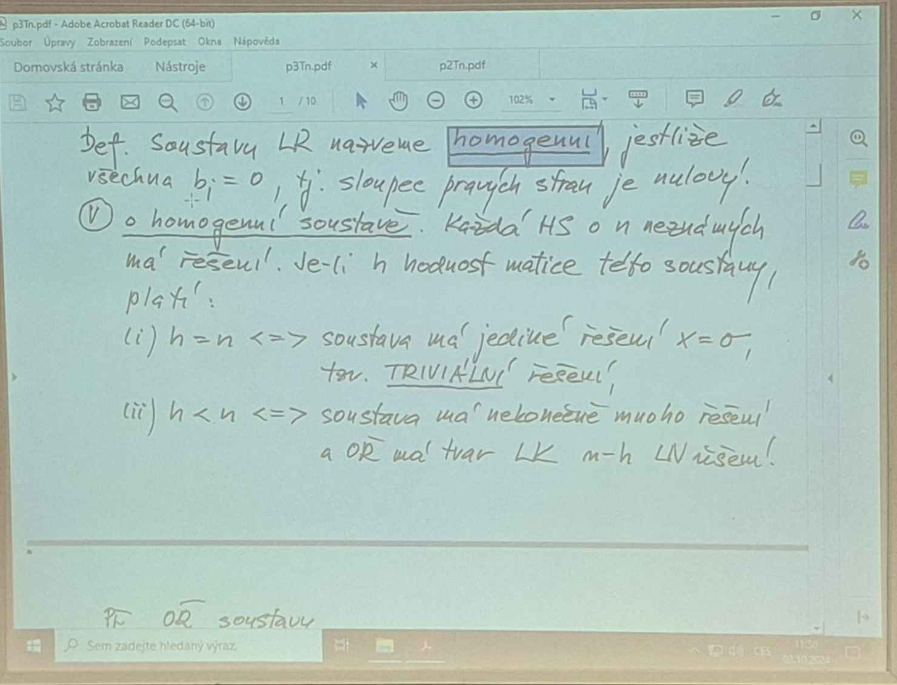
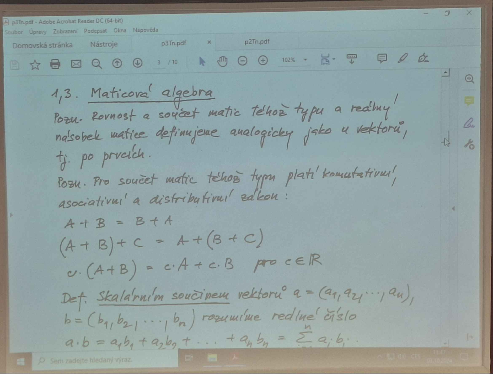
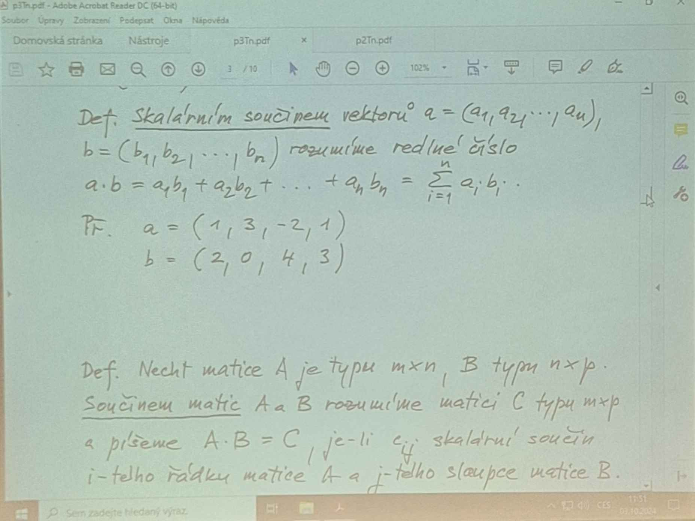

| -1 0 1 | 2 |
| 0  1 2 | 2 |
|        |   |

x3 t =, t∈R

Gauss: -x1 = 2-t
        x2 = 2 -2t

V - o homogenni soustave, kazda HS o n nezmanich ma reseni. je-li h hodmost matice teto soustavy plati:
    (i) h = n <=> soustava ma jedine reseni 
                trivialni reseni
    (ii) h < n <=> soustava ma nekonecne reseni
    

V - o homogenni soustave, kazda HS o n nezmanich ma reseni. je-li h hodmost matice teto soustavy plati:
    (i) h = n <=> soustava ma jedine reseni 
                trivialni reseni
    (ii) h < n <=> soustava ma nekonecne reseni

Priklad

x1 +2x2 - x3 + x4 = 0
          x3 + 2x4 = 0

| 1 2 -1 1|     h=2 < n=4
| 0 0  1 2|     n-4 = 2 ma dva parametry (dev volitelne nezname)

x2= r 
x4 = s  s,r  ∈ R

x1-x3 = -2r-s

<h1>Maticova algebra</h1>

pro soucet matic, tehoz tipu plati
    - komunitativni, asociativni, destribucni zakon

DEF - skalarni soucin vektoru a =  a (a1.a1.a3....an)
b = (b1.b2.b3.....bn) rozumime reaklne cislo
a*b = a1b1 + a2+b2 .....anbn =   _ n
                                \       a;b....
                                /
                                _ = 1

                            
Priklad
    a = (1 .3.-2.1)
    b = (2.0..4.3)

    ab = 1*2+2*0+ (-2)*4+1*3= -3

