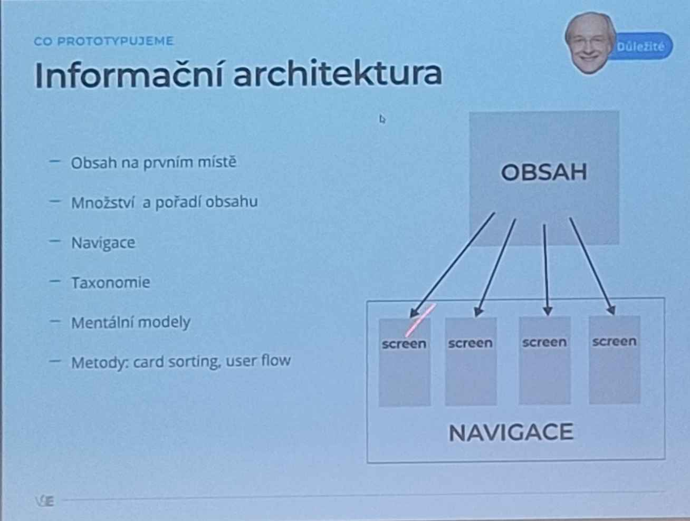
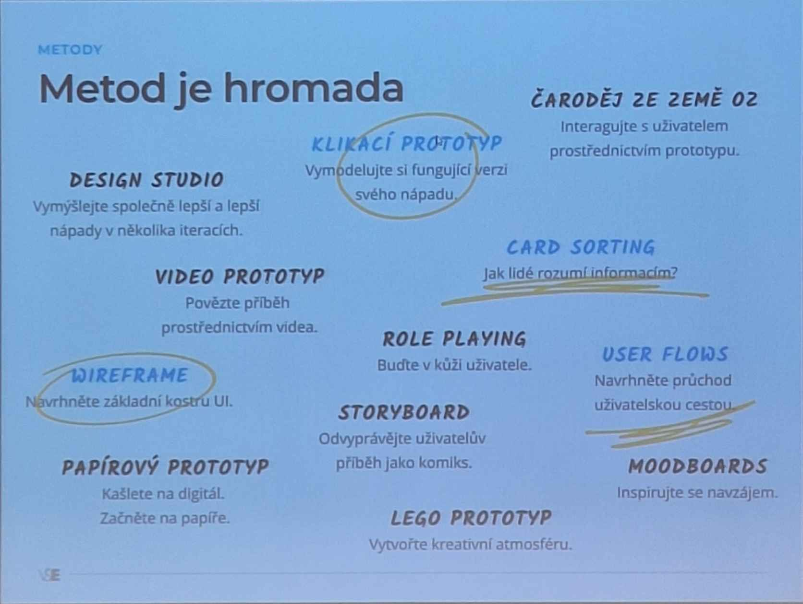

<h1>prototyping</h1>
    -je tvůrčí hodnost
    - jak mo cdetailů?
    - vytváření protoptypu 
        - zisk spětné vazby

    <h3> low/high fidelita</h3>
        <h4>low</h4>
            - málo detailu
            - skica
            - papirove
            - nevyhoda - nízká věrnost
            - výhoda - málo nákladů
        <h4>high</h4> 
            - klakatelné protoptypy, kodem atd
            - výhdoda - přesnostmožnost vyšší spojkojenisti
            - nevýhoda - vysoké náklady, složitá úrava

    <h3>cíle prototypování</h3>
        <h4>externalita</h4>

každé řešení generuje nové (pod)problémy

    <h3>postup</h3>

    <h4>informační architektura</h4>

    homepafe -> výpis receptů -> receptů

